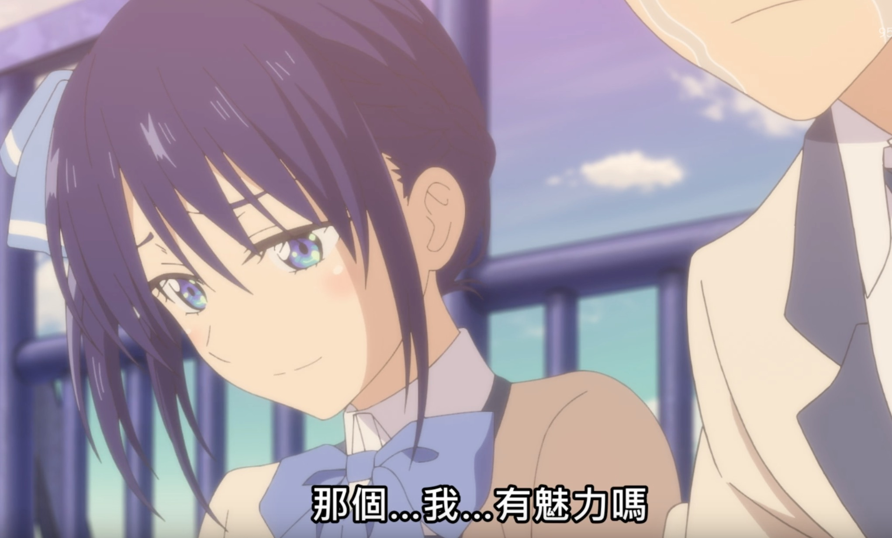
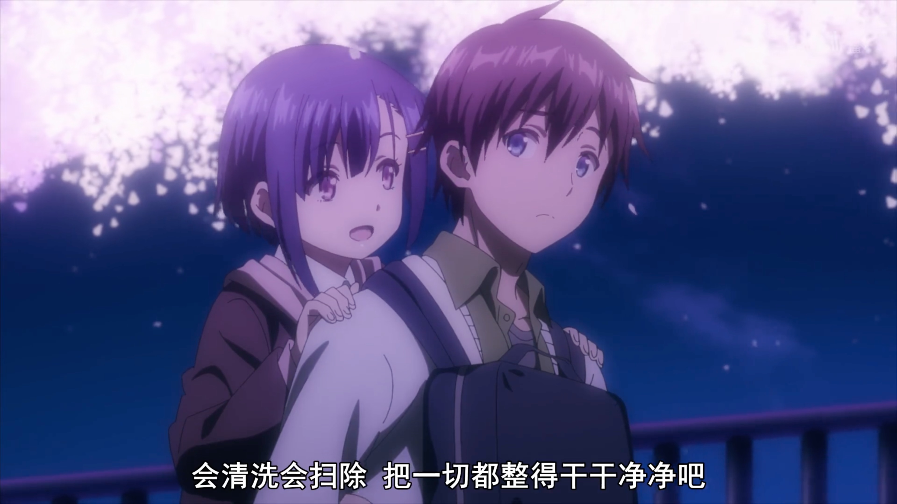
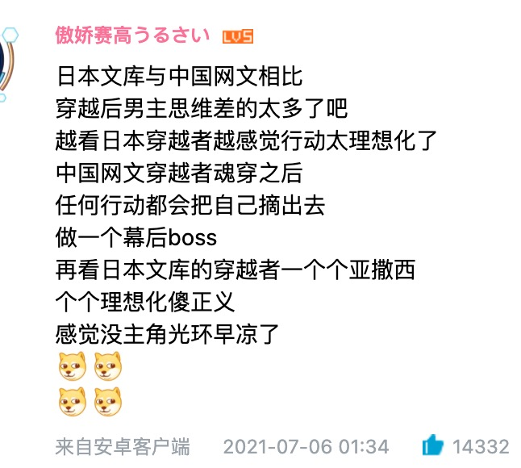

### Hi there 👋

我是一名前端工程师，即将毕业并(划掉)已经入职字节跳动。

初中入门航空模型，高中入坑穿越机，但由于各大城市的禁飞政策和设备难以运输等原因，目前最大的爱好是**后宫/校园/恋爱**向番剧，其次是*哆啦A梦*（包括TV动画和各剧场版动画）、*猫和老鼠*，闲暇之余也会看一些有趣或热血的番，比如*鬼灭之刃*、Re0等

<!--
**Vince-9/Vince-9** is a ✨ _special_ ✨ repository because its `README.md` (this file) appears on your GitHub profile.

Here are some ideas to get you started:

- 🔭 I’m currently working on ...
- 🌱 I’m currently learning ...
- 👯 I’m looking to collaborate on ...
- 🤔 I’m looking for help with ...
- 💬 Ask me about ...
- 📫 How to reach me: ...
- 😄 Pronouns: ...
- ⚡ Fun fact: ...
-->

## 2021年7月 新番推荐

### 后宫/恋爱类

#### [女友成双](https://www.95dm.com/p/4579-0-0.html)
我挺期待的番，但由于又又又涉及社会敏感话题，B站没有没有购买版权，就不能看弹幕了。总体来看这是一部偏搞笑的番，声优：佐仓绫音、高桥李一、竹达彩奈。女一的性格也很符合佐仓的爱好呢。如果女二的声优换小水，男主声优换松冈，那么这番将绝杀，可惜换不得。

其实感觉就是一部正常的后宫番，为什么会有人扯价值观呢？

只能说时代变了，大人。希望哪天又能在B站正常看这种类型的番了。

### 大众向
#### [我们的重制人生](https://www.bilibili.com/bangumi/play/ss38865/)

第一集长达50分钟，想起了re0。故事讲述28岁的男主职业生涯不顺利，虽然工作能力强但总遇上公司倒闭或项目取消，怀才不遇，不得已用最后一点钱买车票回家的他幻想十年前在面临大学选择的问题时，如果选了艺大是否会有不一样的人生。一觉醒来后男主真的回到了十年前刚考上艺大的时候，他将如何重制他的人生？

看了两集后我感觉制作还是很精良的，但评论区的原作大神都说什么节奏太快、缺少主角心理变化描写啥的。感觉原作党的眼光好高。

#### [侦探已死](https://www.bilibili.com/bangumi/play/ss38945/)

《侦探已死》，又名《坐飞机，然后捡到白毛侦探》。

看到女主容貌的第一反应：鸢一折纸，是你吗？

白毛！YYDS！

希耶斯塔我真的爱了，很可爱。第一话就换装数次，每次都足以让人发AWSL。就是男主的声优似乎是个新人？感觉感情不是很到位。

#### [小林家的龙女仆第二季](https://www.bilibili.com/bangumi/play/ss38921/)

只能说：好耶！京阿尼又回来了！

想起高三的时候每周躺在床上看龙女仆的日子，太美妙了。

#### [精灵幻想记](https://www.bilibili.com/bangumi/play/ss38933/)

开局第一分钟就穿越了，很直接，穿越的道具是火车+公交。

虽然很明显是个常见的异世界逆袭故事，但看完第一集后感觉值得一看，人物智商基本在线，男主行事亚撒西+正直，救了人的男主反而惨遭毒打这一段让人很气，第一集的内容仿佛在凸显封建制度的劣根性。

男主声优：松冈祯丞。

不得不说中国的网文还是领先业界的：

## 2021年4月 后宫校园恋爱类番剧推荐

### [剃须，然后捡到女高中生](https://www.bilibili.com/bangumi/play/ss38393/)

这是一部争议非常大、先漫画化后动画化的作品，原作小说以`神待少女`（用身体换住宿）为噱头，可以说一开始就把设定写死了，小说作者后续又加了很多奇怪的设定，导致女主的形象更崩坏了。

但，那又怎样呢？

沙优很可爱不是吗！かわいいでしょう！

在我看了漫画后，依然非常期待这部作品，大概是因为女主的形象很可爱、和男主的日常生活很温馨吧。当成一部拯救失足少女的正能量番来看好了🐶，这些设定都很有趣，不是吗。

一开始我还担心B站不会买剃须，但好在还是买了港澳台的版权，随便切个香港🇭🇰的节点就能看啦（B站搜索`刮掉鬍子的我與撿到的女高中生`）。

### [青梅竹马绝对不会输的恋爱喜剧](https://www.bilibili.com/bangumi/play/ep395138)

为什么不会输，因为大家都是青梅竹马嘛。

一看到声优表就震惊了，水濑祈和佐仓绫音（默默摸了下我AirPods上刻的字），松冈和英梨梨。。还有优吉欧。

泛式：这是什么五等分的路人女主在刀剑神域寻求邂逅是否搞错了点埃罗芒阿大型联动DLC吗？

于是看了下漫画了解剧情，emmm，确实是全员复仇反套路番，非常值得期待。

### [五等分的新娘(第二季)](https://www.bilibili.com/bangumi/play/ss36166/)

不多说，五月吃饱就行。

后宫番爱好者必看，动画第二季已完结，收到消息说已经确定制作第三季了（狂喜），第三季四叶党过年啊，真羡慕四叶党。

漫画全彩版也快完结了，而且只比黑白版贵亿点点，可堪一看。

另外强烈推荐`二乃党`玩一下民间制作的同人游戏[《五等分的抢婚》](https://www.bilibili.com/video/BV1ai4y1P7oG)，真的会dokidoki。